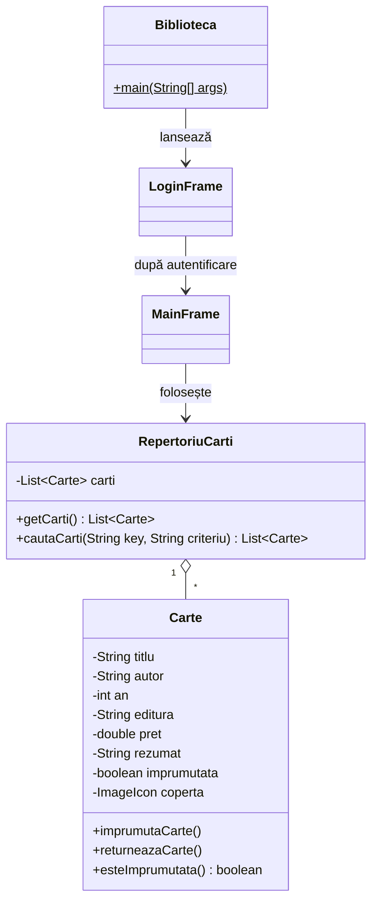

# Biblioteca

Aplicație desktop în **Java (Swing)** pentru gestionarea unei colecții de cărți dintr-o bibliotecă. După autentificare, utilizatorul poate vizualiza lista cărților, le poate căuta după mai multe criterii, poate consulta detaliile fiecărei cărți (inclusiv coperta) și poate împrumuta sau returna cărți.

## Cuprins

- [Funcționalități](#funcționalități)
- [Capturi de ecran](#capturi-de-ecran)
- [Cerințe](#cerințe)
- [Structura proiectului](#structura-proiectului)
- [Instalare și rulare](#instalare-și-rulare)
- [Utilizare](#utilizare)
- [Arhitectura aplicației](#arhitectura-aplicației)
- [Limitări cunoscute și dezvoltări viitoare](#limitări-cunoscute-și-dezvoltări-viitoare)

## Funcționalități

- **Autentificare** cu nume de utilizator și parolă
- **Listă de cărți** cu indicarea stării (cărțile împrumutate apar marcate cu `(Imprumutata)`)
-  **Căutare** după titlu, autor, an sau editură (căutarea nu ține cont de majuscule/minuscule)
- **Detalii carte**: titlu, autor, an, editură, preț (RON), stare, rezumat și imaginea copertei
- **Împrumut și returnare** de cărți, cu mesaje de eroare pentru acțiuni invalide
- **Scurtături de tastatură**: `CTRL + I` (împrumută) și `CTRL + R` (returnează)
- **Meniu Ajutor** cu secțiunile *Despre*, *Tutorial* și *Scurtături*
- **Temă întunecată** personalizată și stil nativ al sistemului de operare pentru restul componentelor

## Capturi de ecran

> Adaugă aici capturi de ecran ale aplicației (ex. în folderul `docs/`).
>
> ```md
> 
> 
> ```

## Cerințe

- **JDK 8 sau mai nou** (codul folosește expresii lambda)
- (Opțional) fontul **JetBrains Mono** instalat în sistem – dacă lipsește, Java folosește automat un font implicit

## Structura proiectului

```text
.
├── Biblioteca.java        # codul sursă (toate clasele aplicației)
├── img/                   # imaginile folosite de aplicație
│   ├── harry-potter-si-piatra-filosofala--bg1.png
│   ├── marele-gatsby-curtea-veche-bg1.png
│   ├── 1984-vol-6-bg1.png
│   ├── sa-ucizi-o-pasare-cintatoare-editie-de-buzunar-bg1.png
│   ├── hobbitul-editie-ilustrata-bg1.png
│   └── lovepik-learning-english-books-material-png-image_400234770_wh1200.png   # iconița ferestrelor
└── README.md
```
> [!WARNING]
> Căile imaginilor sunt **relative**, deci aplicația trebuie rulată din folderul care conține directorul `img/`.

## Instalare și rulare

### 1. Clonează repository-ul

```bash
git clone https://github.com/TheMysteryX/Aplicatie-Java-Biblioteca.git
cd Aplicatie-Java-Biblioteca
```

### 2. Compilează

```bash
javac Biblioteca.java
```

### 3. Rulează

```bash
java Biblioteca
```

Alternativ, proiectul poate fi deschis în orice IDE (IntelliJ IDEA, Eclipse, NetBeans, VS Code) și rulat prin clasa `Biblioteca`, care conține metoda `main`.

## Utilizare

### Autentificare

La pornire se deschide fereastra de autentificare. Credențialele implicite sunt:

| Utilizator | Parolă |
|------------|--------|
| `maria`    | `1234` |

### Fereastra principală

| Zonă | Descriere |
|------|-----------|
| **Stânga** | Lista cărților |
| **Centru** | Detaliile cărții selectate (titlu, autor, an, editură, preț, stare, rezumat) |
| **Dreapta** | Coperta cărții selectate |
| **Sus** | Panoul de căutare (câmp text + criteriu: *Titlu*, *Autor*, *An*, *Editura*) |
| **Jos** | Butoanele *Imprumuta* și *Returneaza* |

### Împrumut și returnare

1. Selectează o carte din listă.
2. Apasă **Imprumuta** (sau `CTRL + I`) pentru a o împrumuta, respectiv **Returneaza** (sau `CTRL + R`) pentru a o returna.
3. Dacă nicio carte nu este selectată sau starea ei nu permite acțiunea (ex. cartea este deja împrumutată), apare un mesaj de eroare.

### Căutare

Introdu un cuvânt-cheie, alege criteriul din listă și apasă **Cauta...**. Pentru criteriul *An* se acceptă doar valori numerice exacte (ex. `1949`). Pentru a reveni la lista completă, rulează o căutare cu câmpul gol.

## Arhitectura aplicației

Aplicația este organizată în mai multe clase, definite în fișierul `Biblioteca.java`:

| Clasă | Rol |
|-------|-----|
| `Biblioteca` | Clasa principală: setează stilul nativ al interfeței (`UIManager.setLookAndFeel`) și pornește `LoginFrame` în firul grafic (`SwingUtilities.invokeLater`). |
| `Carte` | Modelul de date: `titlu`, `autor`, `an`, `editura`, `pret`, `rezumat`, `coperta` (`ImageIcon`) și starea `imprumutata`. Oferă gettere, metodele `imprumutaCarte()` / `returneazaCarte()` și `toString()`. |
| `RepertoriuCarti` | Colecția de cărți (`ArrayList<Carte>`), inițializată cu 5 cărți, și metoda `cautaCarti(key, criteriu)` pentru căutare. |
| `LoginFrame` | Fereastra de autentificare (`JFrame` cu `GridLayout`); validează credențialele și deschide `MainFrame`. |
| `MainFrame` | Fereastra principală (`BorderLayout`): listă, detalii, căutare, acțiuni, bară de meniu și scurtături de tastatură. |



### Detalii de implementare

- **Căutare:** `cautaCarti` folosește un `switch` pe criteriu și compară șirurile cu `toLowerCase()` și `contains()`. Pentru *An*, cheia este convertită cu `Integer.parseInt`, iar `NumberFormatException` este ignorată (nu se returnează rezultate pentru valori nenumerice).
- **Listă dinamică:** `JList<Carte>` este alimentată printr-un `DefaultListModel`, reîmprospătat de `actualizareListaCarti()` după căutări, împrumuturi și returnări.
- **Selecție:** `ListSelectionListener` verifică `getValueIsAdjusting()` pentru a evita procesarea repetată a evenimentelor.
- **Scurtături:** sunt implementate cu `InputMap` / `ActionMap` (`WHEN_IN_FOCUSED_WINDOW`), iar acțiunea apelează `doClick()` pe butonul corespunzător.
- **Copertă:** imaginea este redimensionată la 120×180 px prin `getScaledInstance()`.
- **Aspect:** culorile, fonturile și chenarele componentelor sunt personalizate; ferestrele de dialog sunt stilizate prin `UIManager.put(...)`.

## Limitări cunoscute și dezvoltări viitoare

- Credențialele sunt scrise direct în cod (`maria` / `1234`) – într-o variantă reală ar trebui stocate și verificate securizat.
- Cărțile sunt definite în cod, iar starea de împrumut **nu se salvează** între rulări.
- Idei de extindere:
  - persistența datelor (fișier, SQLite sau o bază de date relațională);
  - adăugarea, editarea și ștergerea de cărți din interfață;
  - gestionarea mai multor utilizatori și a istoricului de împrumuturi;
  - împărțirea claselor în fișiere și pachete separate;
  - teste unitare pentru `RepertoriuCarti`.
